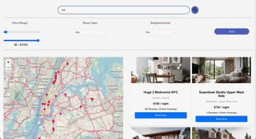

# Stay-NY

Stay-NY is a accomodation booking platform designed for an intuitive and efficient user experience. The app provides dynamic search capabilities, comprehensive filters, and interactive map features to help users easily find and book accommodations in New York. It incorporates modern web technologies and a robust backend to ensure reliable performance and scalability.

## Features

* Search Functionality: Perform keyword searches to find hotels based on names, hosts, neighborhoods, and room types.
* Advanced Filtering: Refine results with price ranges, neighborhood selection, and room type preferences.
* Interactive Map Integration: View properties on a map and seamlessly navigate to their details by clicking on pins.
* Booking System: Confirm bookings with selected date ranges, which are updated in the backend to disable availability dynamically.
* Real-Time Backend: Built with Elasticsearch for efficient search operations and Flask for a responsive backend API.

## Getting Started 

### Prerequisites
* Node.js: Install the latest version from [Node.js official website](https://nodejs.org).  
* Python 3.x: Required to run the Flask server.
* Elasticsearch: Ensure you have an instance of Elasticsearch running. You can use a local instance or a cloud-hosted version.

  

### Installation  

1. **Clone the Repository:**  
   ```bash
   git clone https://github.com/spoorthiuk/Stay-NY.git
   cd stay-ny
   
2. **Frontend Setup:**
    Navigate to the frontend directory:
     ```bash
     cd stay-NY
     npm install
    Start development server
     ```bash
     npm start

3. **Backend Setup:**
   ```bash
     source venv/bin/activate
     python app.py

4. **Configure Elasticsearch:**
Update the backend's configuration to connect to your Elasticsearch instance. Ensure your credentials, endpoint, and indices match your setup.

## Usage
* Open the app in your browser at http://localhost:3000.
* Use the search bar to find accommodations based on your preferences.
* Refine your results using filters for price, neighborhood, and room type.
* Explore properties on the map, and click pins to view more details.
* Select date ranges and confirm bookings. The app will dynamically update availability.

## Architecture Overview

* **Frontend:** Built with React.js for a fast and responsive user interface. Includes Leaflet.js for map integration.
* **Backend:** Flask serves as the API layer, connecting to Elasticsearch for search operations and managing bookings.
* **Database:** Elasticsearch stores hotel data


